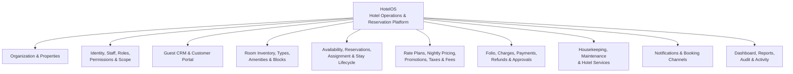
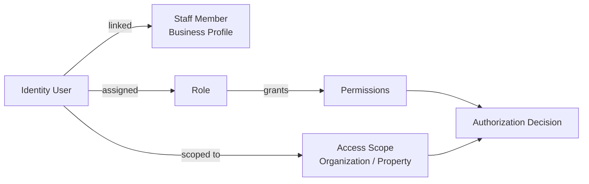
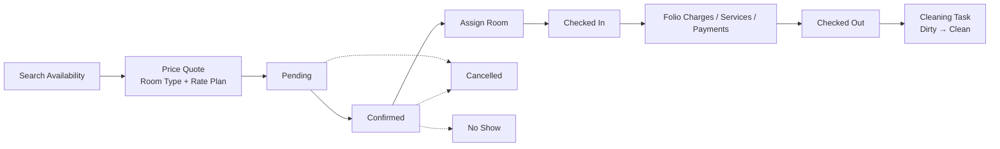
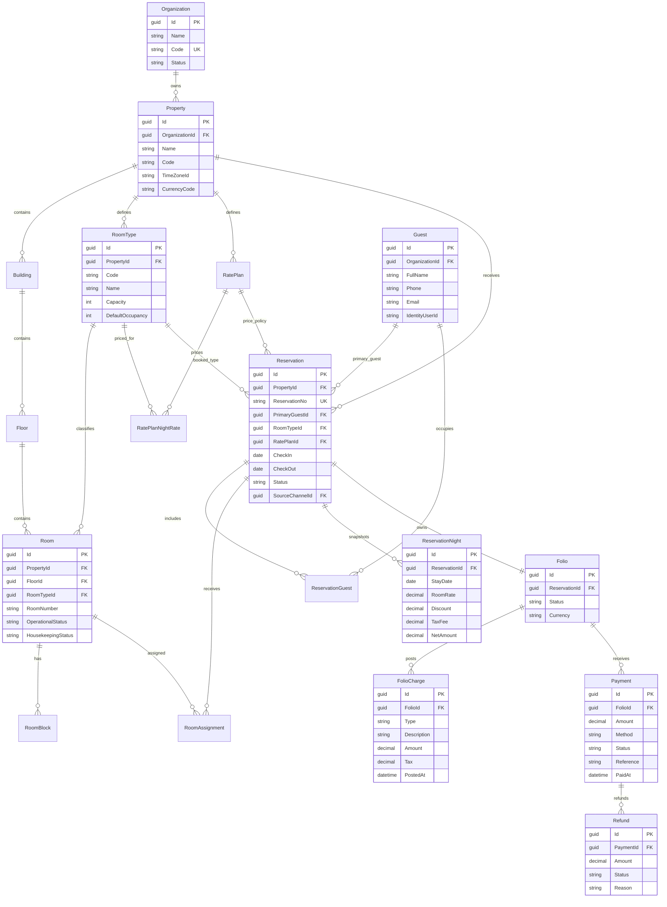
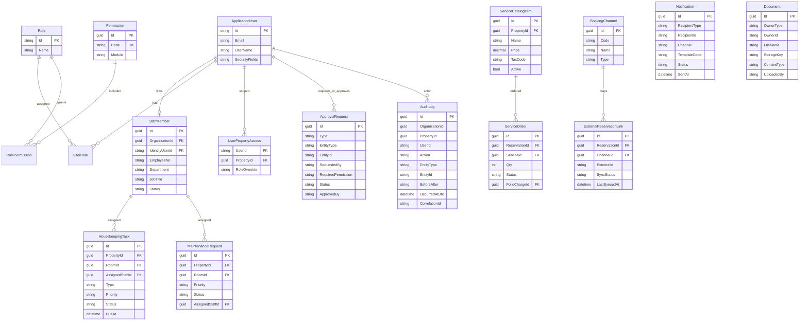
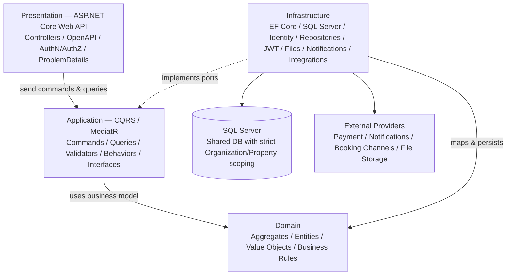

# HotelOS

**Hotel Operations & Reservation Management Platform**  
**Master Product & Execution Pack — v1.0**

BRD • RSD • ERD • Architecture • Implementation Plan • Task Breakdown • Estimated Hours

> **Scope status:** Frozen v1.0 product baseline for backend design and implementation. Features are phased, not removed.

## Contents

1. BRD — Business Definition
2. BRD — Organization, Access & Business Rules
3. BRD — Core Business Workflows & Scope
4. RSD — Organization, IAM & Inventory
5. RSD — Reservation, Availability & Pricing
6. RSD — Finance, Operations, Portal, Integration & Reporting
7. ERD — Core Commercial & Reservation Model
8. ERD — Identity, Operations, Integration & Audit
9. Technical Architecture & Layer Responsibilities
10. Security, Data Integrity & Non-Functional Requirements
11. Implementation Roadmap
12. Implementation Task Breakdown
13. Estimated Effort
14. Architecture Decisions & Definition of Done

---

## 1. BRD - Business Definition

Purpose: define what the product is, who uses it, how the business operates, and the rules the system must protect.

| **Product Vision** A multi-organization, multi-property hotel operating platform that unifies inventory, reservations, guest relationships, access control, pricing, folio/billing, payments, housekeeping, maintenance, services, reporting, customer self-service and external booking channels behind an API-first backend. |
|--------------------------------------------------------------------------------------------------------------------------------------------------------------------------------------------------------------------------------------------------------------------------------------------------------------------------------|

Business objectives

> • Provide one trusted operational source for organizations managing one or many hotel properties.
>
> • Prevent inventory conflicts and preserve reservation, financial and operational history.
>
> • Give each staff member exactly the actions and property scope required by their role and permissions.
>
> • Support direct staff reservations and customer self-service without duplicating business logic.
>
> • Build a financial trail from reservation pricing to folio charges, payments, refunds and approvals.
>
> • Support day-to-day operations after the booking: check-in/out, housekeeping, maintenance and hotel services.
>
> • Create an integration-ready foundation for online payments, notifications and external booking channels.

Business actors and responsibilities

| **Actor**                  | **Primary business responsibility**                                                                            |
|----------------------------|----------------------------------------------------------------------------------------------------------------|
| Platform / Support Admin   | Platform support, organization onboarding, audited support access; not invisible unrestricted business access. |
| Organization Owner / Admin | Organization settings, property access, users, roles, permissions, cross-property reporting.                   |
| Property Manager           | Property operations, pricing oversight, reports, approvals and staff supervision.                              |
| Receptionist / Front Desk  | Guests, reservations, room assignment, check-in/out, allowed payment operations.                               |
| Accountant / Finance       | Folios, payments, refunds, reconciliation and financial reports according to permission scope.                 |
| Housekeeping Staff         | Assigned rooms/tasks, task status, room cleanliness state.                                                     |
| Maintenance Staff          | Maintenance requests, assignment, resolution and room operational blocks.                                      |
| Guest / Customer           | Search availability, book, pay, manage eligible reservations, documents/preferences and service requests.      |

## 2. BRD - Organization, Access & Business Rules

Organization model

> • Organization is the top business boundary (hotel group/company). Data is strictly scoped by OrganizationId.
>
> • An Organization owns one or more Properties. A Property is the physical hotel/resort operating unit.
>
> • A Property may contain optional Buildings/Wings, Floors, Room Types and Rooms.
>
> • Property owns local operational context such as timezone and currency. Technical timestamps are stored in UTC.
>
> • A user can be granted access to multiple properties; property access is modeled separately from the Identity user record.

Authorization rule

| **Decision formula** Authorization = authenticated identity + granted permission + resource/property scope + optional approval rule. A role name alone is never sufficient for sensitive operations. |
|------------------------------------------------------------------------------------------------------------------------------------------------------------------------------------------------------|

| **ID** | **Business rule**                                                                                                                                             |
|--------|---------------------------------------------------------------------------------------------------------------------------------------------------------------|
| BR-001 | Organization data must be isolated from other organizations at every query/write boundary.                                                                    |
| BR-002 | Room number must be unique within its property; transactional records are never hard-deleted.                                                                 |
| BR-003 | Booking availability is derived from inventory, reservations, room assignments/blocks and operational status - never a stored IsReserved flag.                |
| BR-004 | Public/direct booking reserves Room Type inventory; physical Room assignment may happen later.                                                                |
| BR-005 | No active overlapping room assignment may exist for the same physical room and date range.                                                                    |
| BR-006 | Reservation pricing is snapshotted by stay night so later rate-plan changes do not rewrite history.                                                           |
| BR-007 | The training rule remains supported: stays longer than 7 nights can receive the configured 10% automatic discount; richer promotion rules coexist separately. |
| BR-008 | Reservation lifecycle is controlled: Pending, Confirmed, CheckedIn, CheckedOut; Cancelled and NoShow are terminal alternatives.                               |
| BR-009 | Cancelled reservations remain auditable and stop consuming sellable inventory according to cancellation effective state.                                      |
| BR-010 | Financial state is represented through Folio + Charges + Payments + Refunds, not a single IsPaid flag.                                                        |
| BR-011 | Manual discounts, price overrides and refunds above configured thresholds require approval.                                                                   |
| BR-012 | Checkout creates/queues the required housekeeping cleaning work and updates cleanliness workflow.                                                             |
| BR-013 | Maintenance can block a room from sale for a specified period when severity requires it.                                                                      |
| BR-014 | Guests may exist without login accounts; a portal Identity account may link to an existing Guest profile.                                                     |
| BR-015 | External booking sources preserve channel and external reference for idempotency/synchronization.                                                             |
| BR-016 | Sensitive business/security changes are written to audit history with actor, time, entity and correlation context.                                            |

## 3. BRD - Core Business Workflows & Scope

Reservation-to-stay workflow

| **Stage**              | **Required behavior**                                                                                                                              |
|------------------------|----------------------------------------------------------------------------------------------------------------------------------------------------|
| Availability & quote   | Select organization/property, stay dates, occupancy and optional filters. Return sellable room types/rate plans and calculated price quote.        |
| Reservation creation   | Create/resolve Guest, reserve room-type inventory, persist nightly price snapshot, create folio and initial room charges, persist source/channel.  |
| Confirmation & payment | Apply confirmation/payment policy. Record partial/full payment. Pending reservations can expire/cancel according to policy.                        |
| Room assignment        | Assign a physical compatible room without overlap/block. Assignment can be changed with audit trail before/during stay when business rules allow.  |
| Check-in               | Validate reservation state/date, assigned room readiness, guest information and required financial conditions; record operator/time.               |
| In-stay operations     | Post service/extra charges to folio; process payments; housekeeping/maintenance/service orders operate independently but link back where relevant. |
| Check-out              | Validate/settle folio policy, record checkout, release stay, create cleaning work and preserve final financial snapshot.                           |
| Cancellation / No-show | Apply rate-plan cancellation/no-show policy, release inventory, create/adjust charges/refunds where applicable, maintain complete history.         |

Frozen v1.0 product scope

| **Capability**             | **Scope**                                                                                                                      |
|----------------------------|--------------------------------------------------------------------------------------------------------------------------------|
| Organization & Property    | Organizations, properties, buildings/wings, floors, local timezone/currency/settings.                                          |
| Identity & Access          | ASP.NET Core Identity, staff profile, roles, granular permissions, multi-property scope, approval requests, JWT/refresh token. |
| Guest & Portal             | Guest CRM, optional linked customer account, booking-management APIs, preferences/documents.                                   |
| Inventory                  | Room types, amenities, rooms, operational status, housekeeping status, room blocks.                                            |
| Reservation & Availability | Search/quote, room-type reservation, reservation guests, room assignment, lifecycle, cancellation/no-show, sources/channels.   |
| Pricing                    | Rate plans, nightly rates, discounts/promotions, taxes/fees, historical price snapshots.                                       |
| Finance                    | Folio, charges, payments, partial payment, refunds, outstanding balance, approvals.                                            |
| Operations                 | Check-in/out, housekeeping, maintenance, hotel services/add-ons.                                                               |
| Communication & Channels   | Notification foundation + provider adapters; external channel model + Booking.com-style adapter phase.                         |
| Management                 | Dashboard/reports, audit log, activity timeline, files/documents, localization-ready settings.                                 |

## 4. RSD - Functional Requirements (Organization, IAM, Inventory)

| **ID**    | **Requirement**                                                                                                          | **Acceptance / rule**                                                                        |
|-----------|--------------------------------------------------------------------------------------------------------------------------|----------------------------------------------------------------------------------------------|
| ORG-001   | Create/manage Organizations and Properties with status, code, timezone, currency and settings.                           | Organization/Property codes unique in defined scope; deactivation does not erase history.    |
| ORG-002   | Support optional Building/Wing and Floor hierarchy.                                                                      | Rooms may reference Floor; hierarchy changes must not invalidate historical reservations.    |
| IAM-001   | Authenticate staff/customer accounts using ASP.NET Core Identity and API bearer tokens.                                  | Secure password hashing, lockout/email policy as configured; access/refresh token lifecycle. |
| IAM-002   | Manage roles and granular permissions.                                                                                   | Permission codes are stable business identifiers; role changes audited.                      |
| IAM-003   | Grant each user Organization/Property scope independently of role.                                                       | Every scoped application query/write must enforce organization and property access.          |
| IAM-004   | Support approval requests for configured sensitive actions.                                                              | Request captures operation/entity/value context, requester, approver, status, timestamps.    |
| STAFF-001 | Maintain StaffMember business profile linked one-to-one to an optional/required Identity user according to staff status. | Employee number unique per organization; property assignments supported.                     |
| INV-001   | Manage Room Types with code, name, description, occupancy/capacity and amenity relationships.                            | RoomType belongs to Property; inactive types cannot be newly sold.                           |
| INV-002   | Manage physical Rooms with property, type, optional floor, unique room number and operational/housekeeping states.       | Operational state and cleanliness state are independent; no IsReserved column.               |
| INV-003   | Manage sellability Room Blocks by room/date/reason/status.                                                               | Active overlapping blocks make the room unavailable for assignment/sale.                     |
| INV-004   | Manage Amenities and map them to room types/rooms where required.                                                        | Amenity master data can be deactivated; historical relationships remain readable.            |

Core permission catalogue

| **Permission baseline** Hotels.View/Manage; Properties.View/Manage; Rooms.View/Create/Update/Deactivate; RoomTypes.View/Manage; Guests.View/Create/Update/Export; Reservations.View/Create/Modify/Cancel/CheckIn/CheckOut/AssignRoom/OverridePrice; Payments.View/Create/Refund/Void; Housekeeping.View/Assign/Update; Maintenance.View/Manage; Services.View/Manage/Post; Reports.Operational.View; Reports.Financial.View; Users.View/Manage; Roles.Manage; Permissions.Manage; Settings.View/Manage; AuditLogs.View; Approvals.View/Approve. |
|-------------------------------------------------------------------------------------------------------------------------------------------------------------------------------------------------------------------------------------------------------------------------------------------------------------------------------------------------------------------------------------------------------------------------------------------------------------------------------------------------------------------------------------------------|

## 5. RSD - Functional Requirements (Guest, Reservation, Availability, Pricing)

| **ID**   | **Requirement**                                                                                                   | **Acceptance / rule**                                                                                             |
|----------|-------------------------------------------------------------------------------------------------------------------|-------------------------------------------------------------------------------------------------------------------|
| GST-001  | Create/search/update Guest profiles and preserve stay history.                                                    | Duplicate resolution uses configured identifiers (phone/email/document); sensitive fields permission-protected.   |
| GST-002  | Link an optional customer Identity account to a Guest profile.                                                    | Guest can exist without account; account linkage is audited and unique where required.                            |
| RES-001  | Search room-type availability by property, check-in/out, occupancy and filters.                                   | Result excludes unsellable inventory and returns available quantity/rate options.                                 |
| RES-002  | Generate deterministic price quote by room type, rate plan, nightly prices, discounts/promotions, taxes and fees. | Quote contains line-level/nightly breakdown and expiration/version context where needed.                          |
| RES-003  | Create reservation against RoomType, primary guest and stay dates.                                                | Validation: check-out > check-in, occupancy within policy, availability exists, source recorded.                 |
| RES-004  | Persist ReservationNight snapshots.                                                                               | Each stay date stores room rate, discount, taxes/fees and net amount used for historical totals.                  |
| RES-005  | Attach additional reservation guests.                                                                             | Primary guest remains explicit; occupancy counts remain consistent.                                               |
| RES-006  | Assign/change a compatible physical room.                                                                         | No overlap with active assignment/block; room type compatibility enforced; operation audited.                     |
| RES-007  | Support lifecycle transitions Pending/Confirmed/CheckedIn/CheckedOut/Cancelled/NoShow.                            | Invalid transitions rejected by domain/application rule; transition actor/time stored.                            |
| RES-008  | Cancel reservation subject to rate-plan/cancellation policy and permission/approval rules.                        | Inventory released; applicable financial adjustment/refund recorded; reservation retained.                        |
| RES-009  | Search reservations by number, guest, phone/email, room, dates, status, source and external reference.            | Results tenant/property scoped; sensitive fields protected.                                                       |
| RATE-001 | Manage Rate Plans and room-type nightly rates.                                                                    | Rate plan belongs to property, defines refundability/cancellation policy and active selling window/rules.         |
| RATE-002 | Support automatic discounts/promotions and approved manual adjustments.                                           | Automatic training rule >7 nights => 10% supported as configurable rule; stacking/priority explicitly defined.  |
| RATE-003 | Calculate taxes/fees separately from base room rate and discounts.                                                | Financial breakdown remains explainable and reproducible from snapshot data.                                      |
| CHAN-001 | Record booking source/channel and optional external reservation ID.                                               | External ID unique within channel/property/organization as defined; repeated integration requests are idempotent. |

Availability invariant

| **No double sell / assignment** For a requested stay or assignment, availability must consider room-type inventory, active reservations, physical room assignments, room blocks and operational sellability. Overlap rules are transaction-safe; two concurrent requests must not create conflicting confirmed inventory/assignments. |
|---------------------------------------------------------------------------------------------------------------------------------------------------------------------------------------------------------------------------------------------------------------------------------------------------------------------------------------|

## 6. RSD - Functional Requirements (Finance, Operations, Portal, Integration, Reporting)

| **ID**     | **Requirement**                                                                                                                    | **Acceptance / rule**                                                                                                                       |
|------------|------------------------------------------------------------------------------------------------------------------------------------|---------------------------------------------------------------------------------------------------------------------------------------------|
| FIN-001    | Create one active Folio for the reservation/stay and support financial line items.                                                 | Folio currency matches property/reservation context; financial records are immutable-by-history, corrected via compensating entries/status. |
| FIN-002    | Post room and service charges to folio with description, amount, tax and source.                                                   | Each charge traceable to reservation night/service/manual source.                                                                           |
| FIN-003    | Record partial/full payments and calculate outstanding balance.                                                                    | Payment method/status/reference/time/operator preserved; totals derived from ledger.                                                        |
| FIN-004    | Process refunds/voids with permission and threshold approval.                                                                      | Refund cannot exceed eligible paid amount; provider/reference and reason retained.                                                          |
| STAY-001   | Check in eligible confirmed reservation.                                                                                           | Room assigned and ready; date/state/guest/financial policy checks pass; actor/time recorded.                                                |
| STAY-002   | Check out eligible in-house reservation.                                                                                           | Final balance policy handled; checkout recorded; room cleanliness workflow changes and cleaning task is created.                            |
| HK-001     | Create/assign/complete housekeeping tasks and manage room housekeeping status.                                                     | Task lifecycle and staff assignment audited; cleaning completion can move room to clean/inspection state.                                   |
| MNT-001    | Create/assign/resolve maintenance requests.                                                                                        | High-severity/out-of-service request can create/synchronize room block.                                                                     |
| SVC-001    | Manage hotel service catalogue and service orders.                                                                                 | Billable fulfillment creates/links folio charge; status/quantity/operator preserved.                                                        |
| PORTAL-001 | Customer account can search, quote, create/manage eligible bookings, view folio/payment information and submit allowed actions.    | All customer actions limited to linked Guest/account ownership and configured policies.                                                     |
| NOT-001    | Generate notification jobs/events for key business events.                                                                         | Delivery channel/provider implementation is infrastructure; retries/status stored where required.                                           |
| INT-001    | Integrate external booking channel through adapter boundary.                                                                       | Map external reservation IDs, idempotency keys and sync status; internal domain remains provider-independent.                               |
| RPT-001    | Operational dashboard: arrivals, departures, in-house guests, occupancy, room readiness, blocks and outstanding operational tasks. | Scoped by organization/property/date.                                                                                                       |
| RPT-002    | Financial dashboard/reports: revenue, payments, refunds, outstanding balance and approved financial KPIs.                          | Financial permission required; cancelled/refunded semantics explicitly handled.                                                             |
| AUD-001    | Audit sensitive business/security operations.                                                                                      | Actor, time, organization/property, action, entity, correlation context and optional before/after metadata.                                 |
| DOC-001    | Store guest/business documents through storage abstraction.                                                                        | Database stores metadata/storage key, not provider-specific implementation assumptions.                                                     |

## 7. ERD - Core Commercial & Reservation Data Model

PK/FK labels show the intended relational model; exact indexes/types are finalized during EF Core mapping review.

Critical relational decisions

> • Reservation books RoomType; RoomAssignment links physical room when assigned. This separates sellable inventory from room allocation.
>
> • ReservationNight is the pricing snapshot and prevents historical totals from changing when RatePlan prices change later.
>
> • Folio is the financial account for the stay; charges, payments and refunds remain independent auditable transactions.
>
> • RoomBlock is date-bounded and independent from reservation state. Operational status is a separate Room attribute.
>
> • Guest is organization-scoped and reusable across stays; ReservationGuest supports multiple occupants.

## 8. ERD - Identity, Operations, Integration & Audit

Identity / domain separation

> • ApplicationUser is the ASP.NET Core Identity authentication record in Infrastructure. StaffMember is the domain/business employee profile.
>
> • Role grants Permission through RolePermission; UserPropertyAccess controls where the user may exercise permissions.
>
> • ApprovalRequest records sensitive workflow approval without turning authorization into hard-coded role checks.
>
> • HousekeepingTask and MaintenanceRequest reference room/property and optionally StaffMember; they are operational modules, not reservation fields.
>
> • Channel adapters map external reservation identifiers without leaking provider DTOs into Domain/Application.
>
> • AuditLog is optimized for security/business traceability; activity timelines can be derived or maintained separately for user-facing operational history.

## 9. Technical Architecture & Layer Responsibilities

| **Layer**          | **Responsibility**                                                                                                                                                                                                                        |
|--------------------|-------------------------------------------------------------------------------------------------------------------------------------------------------------------------------------------------------------------------------------------|
| Domain             | Pure business model: reservation lifecycle, pricing invariants/value semantics where appropriate, room/folio/stay rules. No ASP.NET Core, EF Core, SQL Server, MediatR or provider code.                                                  |
| Application        | Use cases organized by feature with CQRS. Commands mutate state; Queries read. MediatR dispatch; FluentValidation input validation; pipeline behaviors for validation/logging/authorization as appropriate. Defines infrastructure ports. |
| Infrastructure     | EF Core + SQL Server, DbContext/configurations/migrations, Identity, JWT/refresh-token implementation, repositories/query services, file storage, notifications, payment/channel adapters.                                                |
| API / Presentation | HTTP contracts, controllers/endpoints, authentication wiring, authorization policies, OpenAPI, versioning, ProblemDetails/global exception handling, request context. No business logic.                                                  |
| Database           | Shared SQL Server initially; all business records carry strict organization/property ownership where applicable. Constraints/indexes protect uniqueness and concurrency-sensitive invariants.                                             |
| Cross-cutting      | Structured logging, correlation IDs, audit, current user/tenant context, validation, idempotency, transaction handling, clock abstraction, observability.                                                                                 |

Planned solution shape

| **Projects** HotelOS.Domain \| HotelOS.Application \| HotelOS.Infrastructure \| HotelOS.Api \| tests: Domain.Tests, Application.Tests, IntegrationTests. Application is feature-oriented internally (Reservations/CreateReservation, Rooms/GetAvailableRooms, Payments/RefundPayment, etc.). |
|----------------------------------------------------------------------------------------------------------------------------------------------------------------------------------------------------------------------------------------------------------------------------------------------|

EF Core and database connection placement

> • HotelDbContext, IEntityTypeConfiguration\<T>, repositories/query implementations and Migrations live in Infrastructure/Persistence.
>
> • Connection string and environment configuration live in the API host configuration (appsettings/User Secrets/environment variables), then AddInfrastructure(configuration) wires UseSqlServer.
>
> • Domain has no EF attributes. Database column types, indexes, unique constraints and relationships are defined through Fluent API configurations.
>
> • Migrations are generated from the Infrastructure DbContext and applied by controlled deployment/startup policy, not hidden inside domain logic.

## 10. RSD - Security, Data Integrity & Non-Functional Requirements

| **ID**   | **Area**          | **Requirement**                                                                                                                                                               |
|----------|-------------------|-------------------------------------------------------------------------------------------------------------------------------------------------------------------------------|
| SEC-001  | Authentication    | ASP.NET Core Identity; JWT access token + refresh-token lifecycle for API clients. Secrets never committed to source control.                                                 |
| SEC-002  | Authorization     | Permission + Organization/Property scope required on business operations; customer account restricted to owned/linked guest resources.                                        |
| SEC-003  | Sensitive actions | Refund, high manual discount, price override and configured exceptions use approval workflow and audit.                                                                       |
| SEC-004  | Data protection   | Sensitive guest/document data exposed only to permitted users; logs must avoid secrets/passwords/tokens and minimize PII.                                                     |
| DATA-001 | Tenancy integrity | OrganizationId/property ownership enforced in application query filters/ports and protected by tests; no cross-tenant reads/writes.                                           |
| DATA-002 | Transactions      | Reservation confirmation/assignment/payment state changes use explicit transaction boundaries where multiple writes form one invariant.                                       |
| DATA-003 | Concurrency       | Booking/room assignment conflicts prevented under concurrent requests using database-safe strategy; retry/409 behavior defined.                                               |
| DATA-004 | Idempotency       | External channel/payment write endpoints accept provider/external reference/idempotency keys where duplicate delivery is possible.                                            |
| DATA-005 | Deletion          | Reservations, folios, payments, refunds and audit entries are never hard-deleted. Master data uses Active/Archived status.                                                    |
| PERF-001 | Query performance | Read queries project DTOs, paginate/filter/sort large datasets, use indexes and AsNoTracking where appropriate.                                                               |
| PERF-002 | Target response   | Normal indexed CRUD/search endpoints target sub-second server processing under expected training/demo load; heavy reports are separately profiled.                            |
| OBS-001  | Observability     | Structured logs, correlation/request ID, exception telemetry and health checks. Business audit is separate from diagnostic logging.                                           |
| LOC-001  | Time              | UTC for system timestamps; stay dates/business-day behavior evaluated using Property timezone.                                                                                |
| LOC-002  | Currency          | Financial records preserve currency code; property defines default currency; no implicit cross-currency arithmetic.                                                           |
| API-001  | Errors            | RFC-style ProblemDetails mapping for validation, not-found, conflict, forbidden/domain errors and unexpected failures.                                                        |
| API-002  | Versioning/docs   | OpenAPI documents request/response/status/authorization contracts; endpoint versioning strategy established before breaking public portal/integration contracts.              |
| TST-001  | Testing           | Domain rule unit tests + application handler tests + real database integration tests for EF mappings, constraints, concurrency, authorization scoping and critical workflows. |
| OPS-001  | Recovery          | Database backup/restore and migration rollback strategy documented for deployed environments; integration failures never silently lose internal state.                        |

## 11. Implementation Roadmap - Milestones, Dependencies & Outputs

| **Milestone** | **Workstream**                  | **Primary outputs**                                                                                            | **Hours** |
|---------------|---------------------------------|----------------------------------------------------------------------------------------------------------------|-----------|
| M0            | Product & Architecture Baseline | BRD/RSD/ERD/ADRs/API conventions, repo strategy, naming, DoD                                                   | 8-12      |
| M1            | Solution Foundation             | 4 projects, references, packages, DI, OpenAPI, ProblemDetails, logging, test projects                          | 8-12      |
| M2            | Persistence Foundation          | SQL Server, EF Core, DbContext, configs, migrations, tenant/property context, base transaction conventions     | 10-14     |
| M3            | Identity & Access               | Identity, JWT/refresh, staff profile, roles, permissions, property scopes, authorization policies, seed        | 18-26     |
| M4            | Organization & Inventory        | Organization/property/building/floor, room type, amenity, room, room block                                     | 18-26     |
| M5            | Guest & Customer Accounts       | Guest CRM, search/dedup baseline, account link, customer ownership policy, documents foundation                | 12-18     |
| M6            | Rate & Availability Engine      | Rate plans/nightly rate storage, quote model, taxes/fees/discount rule, availability/search, concurrency tests | 22-32     |
| M7            | Reservation Core                | Create/search/get/modify/cancel/no-show, reservation guests, snapshots, source/channel, room assignment        | 28-40     |
| M8            | Stay Lifecycle                  | Check-in/out, state transitions, room readiness, activity, housekeeping trigger                                | 12-18     |
| M9            | Finance                         | Folio, room/service charges, payments, outstanding balance, refunds, financial approvals                       | 22-32     |
| M10           | Hotel Operations                | Housekeeping, maintenance, service catalog/orders, room operational integration                                | 18-26     |
| M11           | Portal & Notifications          | Customer booking/manage APIs, notification templates/jobs/provider abstraction                                 | 16-24     |
| M12           | Channel Integration             | Channel foundation + one external adapter, mapping/idempotency/sync/error workflow                             | 18-30     |
| M13           | Reporting & Audit               | Operational/financial dashboards, audit, permissions, performance/index review                                 | 16-24     |
| M14           | Hardening & Delivery            | Integration tests, security/scoping review, concurrency, seed/demo data, README/API collection, cleanup        | 22-32     |

| **Dependency path** Foundation -> Persistence/IAM -> Organization & Inventory -> Rate/Availability -> Reservation -> Stay/Finance -> Operations -> Portal/Integrations -> Reporting/Hardening. Cross-cutting tests and documentation are updated continuously, not postponed to the end. |
|--------------------------------------------------------------------------------------------------------------------------------------------------------------------------------------------------------------------------------------------------------------------------------------------------|

## 12. Task Breakdown - Feature Implementation Template & First Backlog

Definition of a feature task chain

| **\#** | **Step**             | **Done means**                                                                                    |
|--------|----------------------|---------------------------------------------------------------------------------------------------|
| 1      | Requirement          | Confirm business rule, actors, permissions, scope, errors and acceptance criteria.                |
| 2      | Domain               | Entity/aggregate/value object changes; invariants and lifecycle rules.                            |
| 3      | Persistence contract | Define exact repository/query/transaction operations needed; avoid generic repository-by-default. |
| 4      | EF mapping           | Configuration, indexes, uniqueness, precision, relationships and migration.                       |
| 5      | Application contract | Command/Query + response DTO + permission requirement.                                            |
| 6      | Validation           | FluentValidation for syntactic/input validation; DB/business rules stay in handler/domain.        |
| 7      | Handler              | Orchestrate ports/domain; cancellation token; transaction/concurrency/idempotency where needed.   |
| 8      | Infrastructure       | Repository/query/provider implementation and efficient EF query/projection.                       |
| 9      | API                  | Route, request/response, authorization, status codes, ProblemDetails and OpenAPI examples.        |
| 10     | Tests                | Unit + handler + integration + authorization/scoping + edge/concurrency cases as applicable.      |
| 11     | Manual verification  | Migration, Swagger happy path, validation, forbidden, conflict/not-found and data review.         |
| 12     | Review & commit      | Clean-code review, naming/dependencies, no layer violations, commit with feature scope.           |

Initial implementation backlog - exact order

| **ID**  | **Task**                                                                                          |
|---------|---------------------------------------------------------------------------------------------------|
| FND-01  | Create solution/projects/references and solution-wide build rules.                                |
| FND-02  | Add Application/Infrastructure dependency registration and API composition root.                  |
| FND-03  | Global ProblemDetails exception handling, structured logging and correlation context.             |
| DB-01   | Configure SQL Server connection, EF Core DbContext, migrations project behavior and health check. |
| IAM-01  | Identity schema/ApplicationUser, roles and initial seed.                                          |
| IAM-02  | Login/refresh/current-user + JWT validation.                                                      |
| IAM-03  | Permission catalogue, RolePermission, UserPropertyAccess and authorization policy handler.        |
| ORG-01  | Organization + Property + timezone/currency.                                                      |
| INV-01  | Building/Floor + RoomType + Amenity.                                                              |
| INV-02  | Room + states + unique room number per property.                                                  |
| INV-03  | RoomBlock and sellability rules.                                                                  |
| GST-01  | Guest profile + search/update + optional account link.                                            |
| RATE-01 | RatePlan + nightly rates + cancellation policy model.                                             |
| AVL-01  | Availability query/read model and tests.                                                          |
| QTE-01  | Pricing quote including discount/tax/fee breakdown.                                               |
| RES-01  | Create Reservation + ReservationNight + Folio + initial charges.                                  |
| RES-02  | Get/Search reservations and scoped projections.                                                   |
| RES-03  | Room assignment with overlap/transaction safety.                                                  |
| RES-04  | Cancel/NoShow + policy + financial adjustment.                                                    |
| STAY-01 | Check-in.                                                                                         |
| STAY-02 | Check-out + housekeeping generation.                                                              |
| FIN-01  | Post payments/outstanding balance.                                                                |
| FIN-02  | Refund + approval.                                                                                |
| OPS-01  | Housekeeping workflow.                                                                            |
| OPS-02  | Maintenance + room block integration.                                                             |
| OPS-03  | Service catalog/order -> folio charge.                                                           |
| PORT-01 | Customer availability/quote/book/manage APIs.                                                     |
| NOT-01  | Notification outbox/job + provider abstraction.                                                   |
| INT-01  | Booking channel model + external adapter/idempotency/sync status.                                 |
| RPT-01  | Operational dashboard.                                                                            |
| RPT-02  | Financial reports.                                                                                |
| AUD-01  | Sensitive audit viewer and authorization.                                                         |
| QLT-01  | End-to-end critical-path integration suite + performance/index review + docs/demo data.           |

## 13. Estimated Effort - Focused Backend Engineering Hours

| **Phase**                    | **Milestones** | **Min h** | **Max h** | **Included**                                            |
|------------------------------|----------------|-----------|-----------|---------------------------------------------------------|
| Product + technical baseline | M0-M2          | 26        | 38        | Docs, architecture, solution and persistence foundation |
| Secure core platform         | M3-M5          | 48        | 70        | Identity/access, organization/inventory, guest/account  |
| Revenue engine               | M6-M9          | 84        | 122       | Rates, availability, reservation, stay and finance      |
| Operations                   | M10            | 18        | 26        | Housekeeping, maintenance, services                     |
| Portal + integrations        | M11-M12        | 34        | 54        | Customer APIs, notifications, one channel adapter       |
| Management + hardening       | M13-M14        | 38        | 56        | Reports/audit, test/security/performance/delivery       |

Totals

| **Core operational backend** Approx. 176-256 focused hours through M10: secure platform + inventory + guests + rate/availability + reservation + stay + finance + hotel operations. |
|-------------------------------------------------------------------------------------------------------------------------------------------------------------------------------------|

| **Full frozen v1.0 backend scope** Approx. 248-366 focused hours including customer portal/notifications, one external channel integration, reporting/audit and hardening. |
|----------------------------------------------------------------------------------------------------------------------------------------------------------------------------|

Estimation assumptions

> • One experienced developer, focused engineering hours - not calendar time. Includes design while implementing, code review of own work, migrations, validation, tests and Swagger/manual verification.
>
> • Backend only. Frontend/admin portal UI and customer website UI are not included.
>
> • External vendor waiting/approval time is excluded. The channel-integration estimate assumes usable API access and documentation; major certification requirements can change it.
>
> • No shortcuts such as skipping permission scoping, concurrency tests, financial auditability or integration tests. These estimates represent the “respectable system” quality bar defined in this pack.
>
> • Estimates are deliberately ranges. After each milestone design is frozen, tasks can be re-estimated at 1-4 hour granularity.

Recommended working cadence

| **Session**                     | **Goal**                                         | **Typical output**                                          |
|---------------------------------|--------------------------------------------------|-------------------------------------------------------------|
| Architecture/feature discussion | Close business + technical decisions before code | Updated requirement/ADR + task acceptance criteria          |
| Implementation block            | One coherent vertical use case                   | Domain -> Application -> Infrastructure -> API           |
| Verification block              | Prove behavior, not only compile                 | Automated tests + Swagger scenarios + DB review             |
| Review/commit                   | Keep repository understandable                   | Clean diff, naming/dependency review, single-purpose commit |

## 14. Architecture Decisions & Definition of Done

| **ADR** | **Decision**                                                                                                                    |
|---------|---------------------------------------------------------------------------------------------------------------------------------|
| ADR-001 | Clean Architecture is the solution boundary model; CQRS/MediatR is an Application-layer use-case pattern, not a separate layer. |
| ADR-002 | Application code is organized by business feature/use case, while dependencies still obey Clean Architecture.                   |
| ADR-003 | Shared SQL Server initially; multi-organization data isolation is logical and mandatory in every business access path.          |
| ADR-004 | ASP.NET Core Identity stays in Infrastructure; Domain models StaffMember/Guest separately from authentication records.          |
| ADR-005 | Authorization uses Role -> Permissions + User property scope; sensitive finance/pricing actions can require approval.          |
| ADR-006 | Bookings reserve RoomType inventory; physical room assignment is separate and concurrency protected.                            |
| ADR-007 | Availability is derived. Room stores operational and housekeeping state, not IsReserved.                                        |
| ADR-008 | Pricing uses RatePlan/nightly values and reservation-night snapshots. Financial calculations use decimal + currency context.    |
| ADR-009 | Folio ledger model is the financial source of truth for charges, payments and refunds.                                          |
| ADR-010 | Transactional/history entities are not hard-deleted; correction is represented by state/compensating operations.                |
| ADR-011 | EF Core mapping is Infrastructure Fluent API; no database annotations in Domain.                                                |
| ADR-012 | Repositories/query ports are feature/domain-specific when they add a boundary; no generic repository template by default.       |
| ADR-013 | External providers are adapters behind Application ports; provider DTOs/SDKs do not leak into Domain.                           |
| ADR-014 | UTC technical timestamps + Property local timezone; Property default currency preserved on monetary transactions/snapshots.     |
| ADR-015 | Audit log is for sensitive/business/security traceability; diagnostic logs remain a separate observability concern.             |

Definition of Done - every feature

> • Business rule and acceptance criteria are explicit before implementation.
>
> • Correct layer ownership; no business logic in controllers and no EF/Identity/provider dependencies in Domain.
>
> • Permission + organization/property scope enforced and covered by tests.
>
> • Input validator and domain/data business validations are separated correctly.
>
> • EF configuration includes required indexes, uniqueness, precision, FK/delete behavior and migration review.
>
> • Command/query honors CancellationToken; write use case has explicit transaction/concurrency strategy when needed.
>
> • API has documented success/error status codes and ProblemDetails behavior in Swagger/OpenAPI.
>
> • Happy path plus critical invalid, forbidden, not-found/conflict and concurrency/financial edge cases tested.
>
> • Logs/audit do not leak secrets; sensitive operations produce required audit records.
>
> • Code compiles warning-clean under agreed rules, naming is clear, duplication is justified/removed, and commit is feature-scoped.

**Technical baseline:** Aligned with the team-lead CQRS deck: Domain core; Application owns use cases/interfaces and Commands/Queries; Infrastructure owns persistence/external services; Presentation accepts requests; CQRS + MediatR + FluentValidation in Application; EF Core mapping in Infrastructure; controllers contain no application logic.
